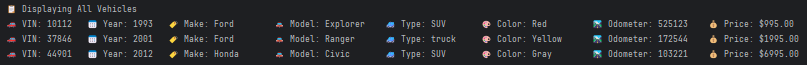

# 🚗🛻🚙 Vehicle Dealership Management System

Welcome to the **Vehicle Dealership Management System**! 
This project allows the user to manage a vehicle inventory for a dealership.
A console-based Java application that simulates a full vehicle dealership management system. 
It supports inventory operations, contract processing, receipt generation, error logging, and an interactive user interface.
This version uses a **MySQL database** and the **DAO (Data Access Object) pattern** for clean data management.


---

## ✨ Features

### 📄 Contract System
- Create and save **Sales** or **Lease** contracts.
- Automatically removes vehicles from inventory after a transaction.
- Sales contracts support financing options.
- Automatically marks vehicle as **sold** in inventory

### 🧾 Receipt Generation
- Console-formatted, professional-style receipts with emojis.
- Clear breakdown of vehicle and transaction details.
- Displays taxes, fees, financing, and monthly payments.

### 🔍 Inventory Search & Filter
- Add, update, or mark vehicles as sold
- Search vehicles by:
  - 💰 Price range
  - 🏷️ Make and Model
  - 📅 Year range
  - 🎨 Color
  - 🛣️ Mileage range
  - 🚘 Vehicle type (Car, Truck, SUV, Van)
- Shows only **available (unsold)** vehicles

### 🛠️ Inventory Management
- Add or remove vehicles via console prompts.
- Changes are saved to `vehicles.csv`.
- Displays all vehicles currently available in the dealership's inventory.

### ⚙️ DAO & Database
- All data stored in **MySQL** (no more CSV files)
- DAOs handle all interactions:
  - `VehiclesDAO`
  - `SalesContractDAO`
  - `LeaseContractDAO`

### Filtering Screenshots

Price Filtering


Make & Model Filtering


Year Filtering


Color Filtering


Mileage Filtering


Vehicle Type Filtering


Display All Vehicles



Adding Vehicle


Removing Vehicle


Buying Vehicle


Leasing Vehicle


---

## 🛠 Technologies Used

| Tech        | Description                         |
|-------------|-------------------------------------|
| Java        | Console application logic           |
| JDBC        | Database connection & SQL queries   |
| MySQL       | Persistent data storage             |
| DAO Pattern | Separation of DB logic              |
| Log File    | Logs exceptions to `exceptions.log` |


---

## 🗂️ File List

| **File Name**                | **Purpose**                                                                       | **Key Features**                                                                                                                                                                               |
|------------------------------|-----------------------------------------------------------------------------------|------------------------------------------------------------------------------------------------------------------------------------------------------------------------------------------------|
| `UserInterface.java`         | Handles the main user interface for the dealership system.                        | - Displays menu with options to filter by price, make/model, year, color, mileage, vehicle type.<br>- Allows users to add or remove vehicles.<br>- Handles input validation for user commands. |
| `Dealership.java`            | Represents the dealership and its inventory of vehicles.                          | - Stores a list of `Vehicle` objects.<br>- Provides methods for filtering vehicles by attributes.<br>- Methods for adding, removing, and retrieving vehicles.                                  |
| `Vehicle.java`               | Represents a single vehicle in the dealership's inventory.                        | - Stores vehicle details (VIN, year, make, model, etc.).<br>- Contains a `toString` method to display vehicle details.                                                                         |
| `DealershipFileManager.java` | Manages loading and saving the dealership's vehicle inventory from/to a CSV file. | - Loads vehicles from a CSV file.<br>- Saves inventory to CSV after updates.<br>- Ensures data persistence.                                                                                    |
| `exceptions.log`             | A log file to track any errors or exceptions that occur during program execution. | - Timestamps errors.<br>- Logs exception messages to help diagnose issues.                                                                                                                     |
| `Contract.java`              | Abstract base class representing a sales or lease contract.                       | - Defines shared contract fields like customer name, date, and vehicle.<br>- Provides common functionality for child contract types.                                                           |
| `ContractFileManager.java`   | Handles reading and writing contract data to a persistent storage file.           | - Saves contract details to a CSV file (e.g., `contracts.csv`).<br>- Supports both sales and lease contract serialization.                                                                     |
| `LeaseContract.java`         | Represents a lease agreement for a vehicle.                                       | - Calculates expected monthly payments.<br>- Includes lease-specific fields such as lease term and rate.                                                                                       |
| `SalesContract.java`         | Represents a finalized contract for a vehicle purchase.                           | - Calculates total cost including fees and sales tax.<br>- Stores details like finance option and down payment.                                                                                |
| `VehiclesDAO.java`           | Handles all vehicle database interactions.                                        | - CRUD operations for vehicles.<br>- Includes filters by price, make, model, year, etc.<br>- Marks vehicles as sold rather than deleting.                                                      |
| `SalesContractDAO.java`      | Handles database operations for sales contracts.                                  | - Inserts new sales contracts into the DB.<br>- Ensures vehicle exists and handles foreign key relations.<br>- Calculates monthly payment and stores full sale details.                        |
| `LeaseContractDAO.java`      | Manages lease contract interactions with the database.                            | - Inserts new lease contracts.<br>- Calculates lease pricing, end dates, and monthly payments.<br>- Enforces referential integrity with `vehicles` table.                                      |
| `Main.java`                  | Entry point of the application.                                                   | - Launches the program.<br>- Calls the `UserInterface` display method.                                                                                                                         |


## 🧪 Experimental / Unused Classes

| **File Name**     | **Purpose**                                                                | **Status**              |
|------------------|-----------------------------------------------------------------------------|-------------------------|
| `InventoryDAO.java` | Intended as an abstraction layer over `VehiclesDAO`. May be used later.  | Unused / For future use |

---

## 📜 Error Logging 

Whenever an error occurs (such as invalid user input or unexpected system failures), the program logs the error details to a file called `exceptions.log`. This log includes:

- **Timestamp**: The date and time when the error occurred.
- **Error Message**: The exception message detailing what went wrong.

This log can help developers diagnose and troubleshoot issues with the program.

### Example of Logged Error:
Time of occurrence: 2025-05-11 14:30:12 Invalid input: -1 for mileage


---

# 🔥 Cool Code Highlight: Dynamic Contract Saving

The `saveContract()` method in ContractFileManager is a great example of clean and scalable code. 
It dynamically detects whether a contract is a sales or lease contract and writes the appropriate data to a shared file (`contracts.csv`).

This design uses polymorphism, Java’s instanceof pattern matching, and structured CSV formatting — making it both powerful and easy to extend in the future.


````
if(contract instanceof SalesContract salesContract) {
    Vehicle chosenVehicle = salesContract.getVehicleChosen();

    //write to sales contract file
    try {
        BufferedWriter bufferedWriter = new BufferedWriter(new FileWriter("contracts.csv", true));
        String isFinanced;
        if(salesContract.isFinanced()) {
            isFinanced = "YES";
        }
        else {
            isFinanced = "NO";
        }

        String firstLine = String.format("SALE|%s|%s|%s|%d|%d|%s|%s|%s|%s|%d|%.2f|%.2f|%.2f|%.2f|%.2f|%s|%.2f\n",
                salesContract.getDate(),
                salesContract.getCustomerName(),
                salesContract.getCustomerEmail(),
                chosenVehicle.getVin(),
                chosenVehicle.getYear(),
                chosenVehicle.getMake(),
                chosenVehicle.getModel(),
                chosenVehicle.getVehicleType(),
                chosenVehicle.getColor(),
                chosenVehicle.getOdometer(),
                chosenVehicle.getPrice(),
                salesContract.calcSalesTax(),
                salesContract.getRecordingFee(),
                salesContract.getProcessingFee(),
                salesContract.getTotalPrice(),
                isFinanced,
                salesContract.getMonthlyPayment()
        );
        bufferedWriter.write(firstLine);

        bufferedWriter.close();
    } catch (IOException e) {
        UserInterface.writeErrorsToLogsFile(e);
    }
}
else if (contract instanceof LeaseContract leaseContract) {
    //TODO: write to lease contract file
    Vehicle chosenVehicle = leaseContract.getVehicleChosen();

    //write to lease contract file
    try {
        BufferedWriter bufferedWriter = new BufferedWriter(new FileWriter("contracts.csv", true));

        String firstLine = String.format("LEASE|%s|%s|%s|%d|%d|%s|%s|%s|%s|%d|%.2f|%.2f|%.2f|%.2f|%.2f\n",
                leaseContract.getDate(),
                leaseContract.getCustomerName(),
                leaseContract.getCustomerEmail(),
                chosenVehicle.getVin(),
                chosenVehicle.getYear(),
                chosenVehicle.getMake(),
                chosenVehicle.getModel(),
                chosenVehicle.getVehicleType(),
                chosenVehicle.getColor(),
                chosenVehicle.getOdometer(),
                chosenVehicle.getPrice(),
                leaseContract.getExpectedEndingValue(),
                leaseContract.getLeaseFee(),
                leaseContract.getTotalPrice(),
                leaseContract.getMonthlyPayment()
        );
        bufferedWriter.write(firstLine);

        bufferedWriter.close();
    } catch (IOException e) {
        UserInterface.writeErrorsToLogsFile(e);
    }


````
---

## ⚠️ Disclaimer

This project is intended for **educational purposes only**. While it simulates a vehicle dealership management system, it is not designed for real-world commercial use.

The data handling (e.g., saving to CSV, logging errors) is simplified for clarity and learning, and does not implement production-level data validation, security, or error recovery.

Use this code at your own risk. The developers are not responsible for any data loss, system issues, or unintended consequences resulting from the use or modification of this software.

> 💡 Always test thoroughly and handle sensitive data responsibly in real-world applications.

---

# 🧑‍💻 Author
💻 Developed by: Meixin Zhang

📅 Date: June 15th, 2025

Created with ❤️ using Java.
